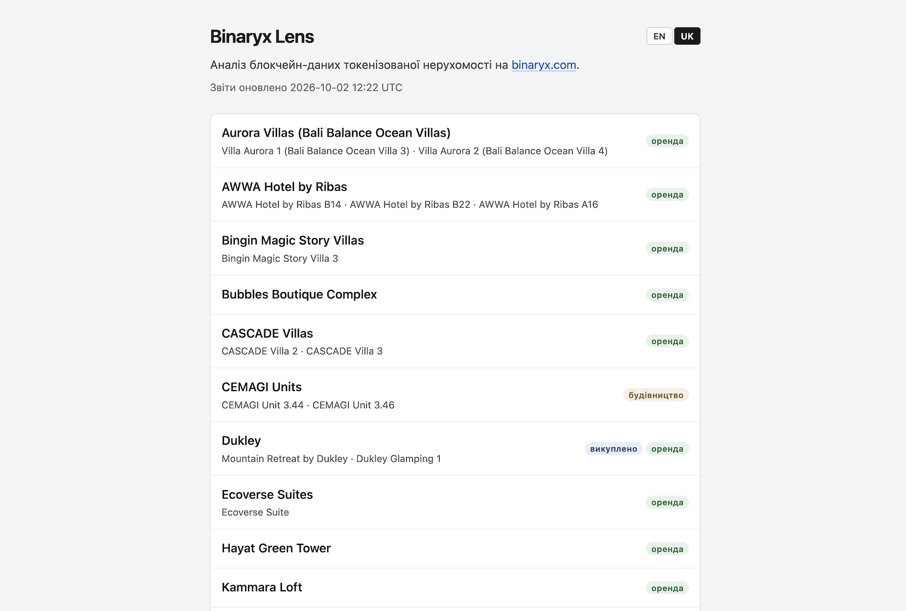
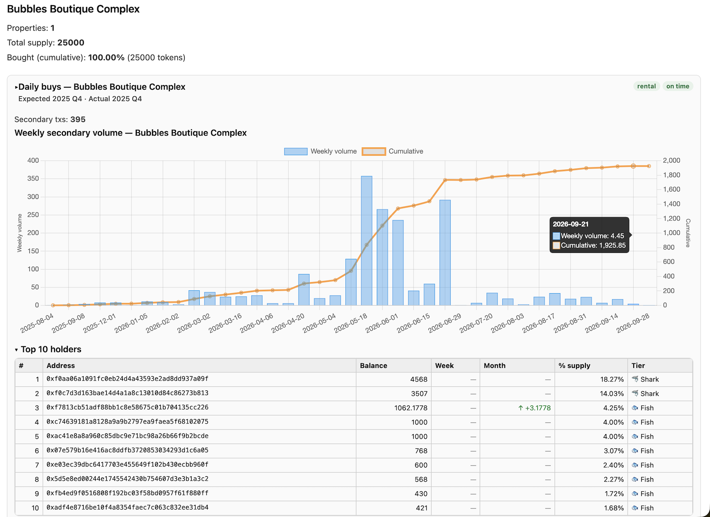
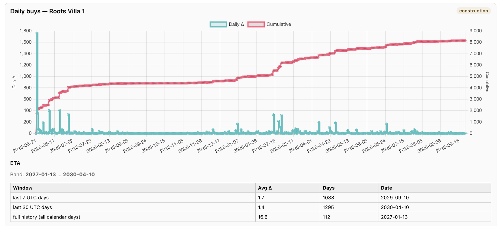
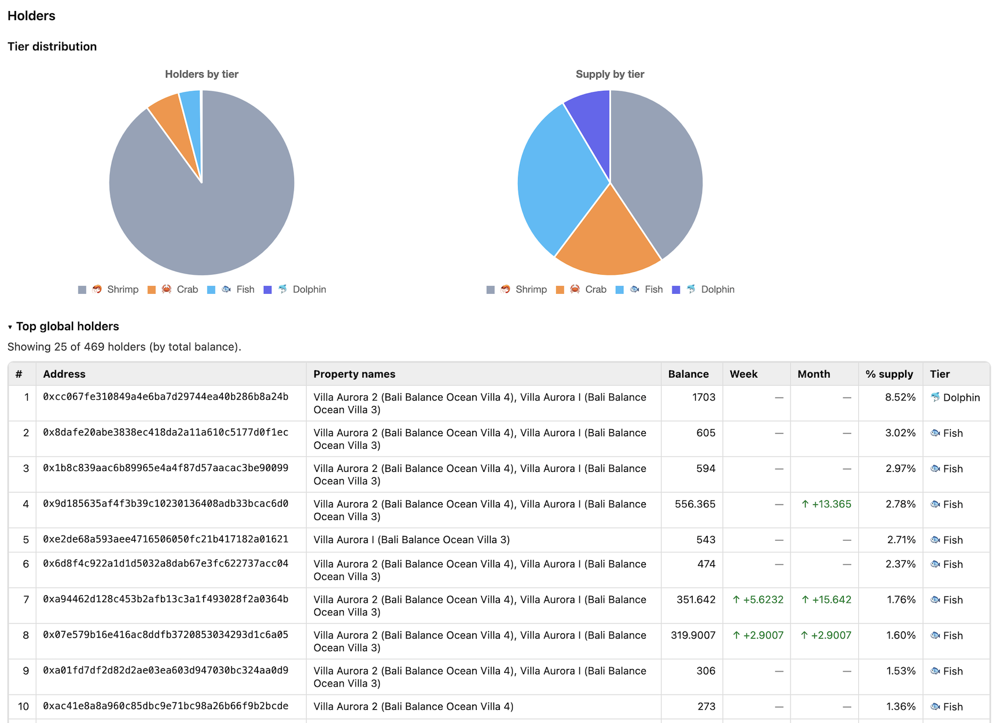

# Binaryx Lens

On-chain analytics for tokenized real estate on [binaryx.com](https://binaryx.com).

**Live reports:** https://aint.github.io/binaryxlens/

## Why

Binaryx sells fractional shares of rental and development properties (Indonesia, Turkey, Montenegro) as ERC-20 tokens on Polygon. The platform shows marketing numbers. Binaryx Lens reads the token transfers straight from the chain and shows what is happening: how fast each property sells, who holds it, and whether rental income starts on time.

## What it shows

Each project gets its own report page with:

- **Summary** — properties, total supply, tokens bought.
- **Property status** — construction, rental or redeemed; expected vs actual rental start date.
- **Initial sales** — daily buys and the cumulative curve, with drag-to-zoom.
- **Sell-out ETA** — projected completion date from moving averages over several trailing windows.
- **Secondary market** — weekly wallet-to-wallet volume and transaction count.
- **Holders** — top holders per property and across the project, with week/month balance changes.
- **Tier distribution** — holders grouped by share of supply: 🦐 shrimp ≤0.5%, 🦀 crab ≤1%, 🐟 fish ≤5%, 🐬 dolphin ≤10%, 🦈 shark ≤20%, 🐋 whale >20%.

Reports are available in English and Ukrainian.

## Screenshots

<!-- TODO: add screenshots to docs/screenshots/ -->

| Index | Project report |
| --- | --- |
|  |  |

| Initial sales & ETA | Holders & tiers |
| --- | --- |
|  |  |

## Run locally

```bash
POLYGONSCAN_API_KEY=<key> go run .
```

Flags:

- `-api-key` — Etherscan v2 API key (overrides the env var).
- `-scan-pause` — pause between API pages (default `400ms`).

Open `index.html` in a browser.

## Disclaimer

Not affiliated with Binaryx. Data comes from public blockchain records and Binaryx website. Not financial advice.
